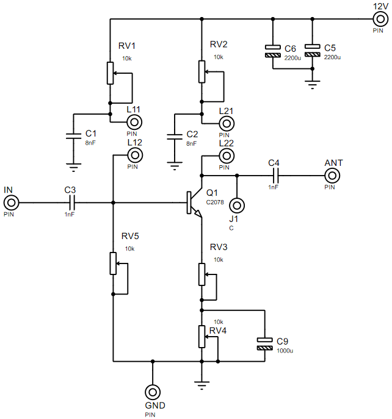
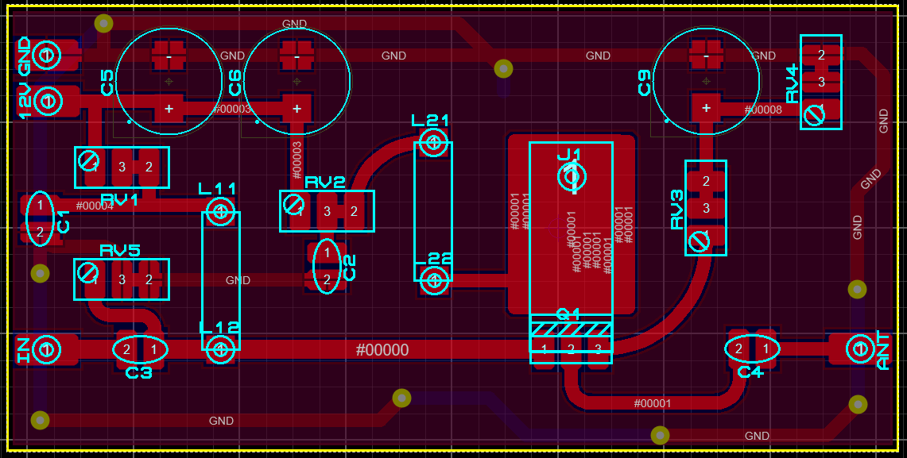
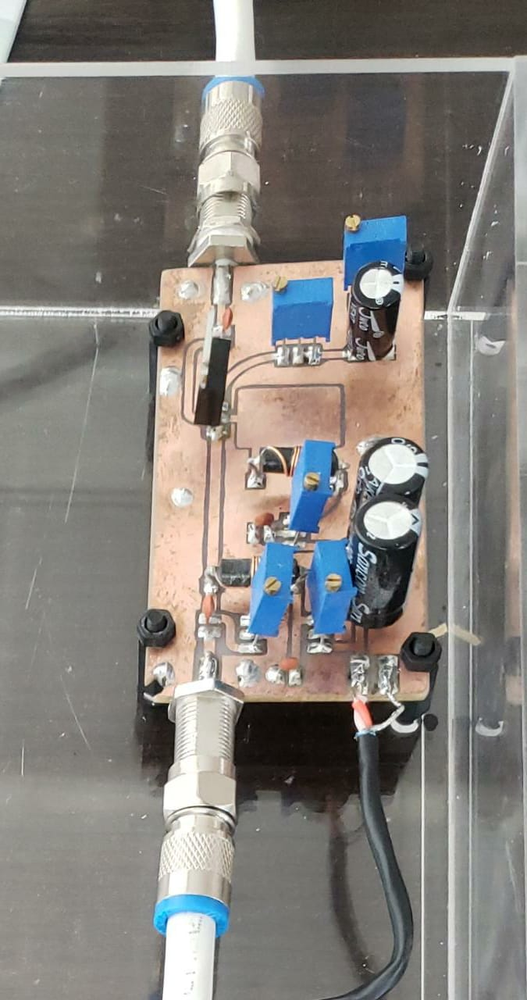

# Amplificador de Potencia

El amplificador de potencia cuanta con un transistor de 3W de salida, el circuito amplificador es de polariazacion por division de tension donde se utiliza bobinas de choque para garantizar que la señal RF entre a la base y salga por el capacitor de salida en el colector del transistor...

el diagrama es el siguiente....

el PCB es el siguiente...

los resultados de la implementacion son...

