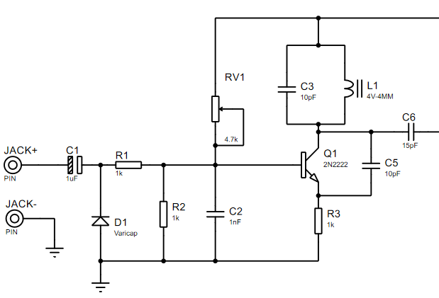
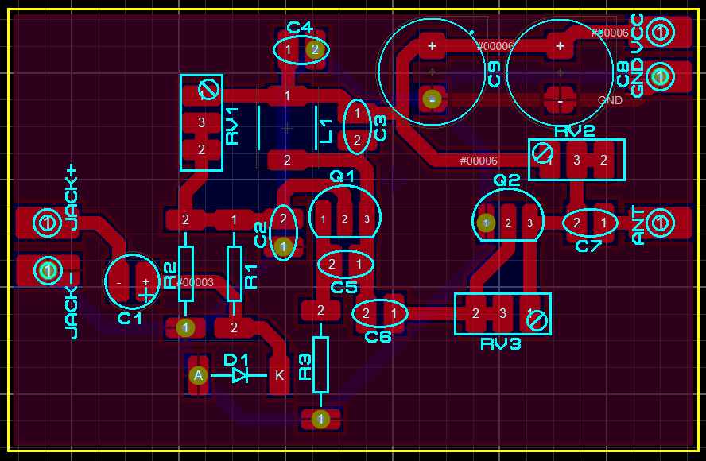
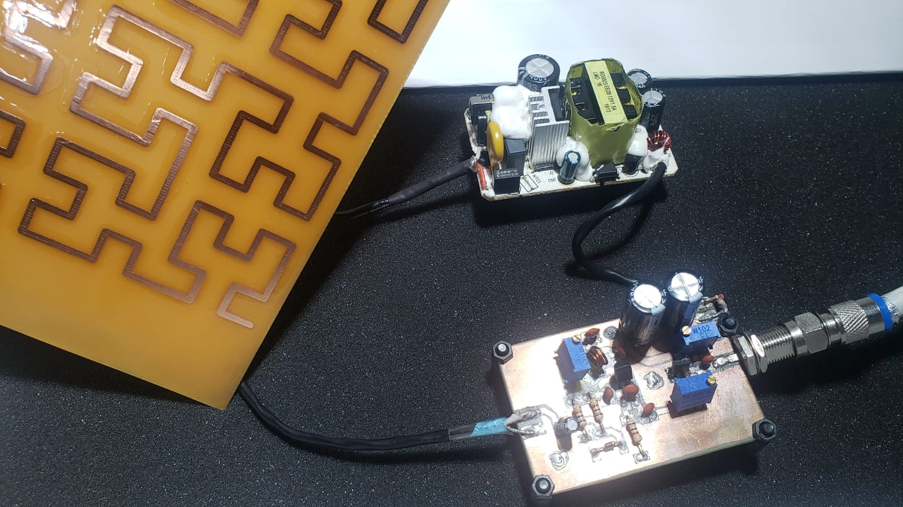

# Circuito Modulador

El circuito modulador consiste en un transistor 2N2222 y un diodo varicap, este ultimo sirve para la modulacion de la señal de audio para cambiar la capacitancia del circuito tanque, teniendo asi una variacion de la frecuencia, teniendo asi una modulacion por variacion de frecuencia o FM.

Diagrama de Circuito es el siguiente...

la PCB se creo en conjunto con la etapa de PreAmplificacion, asi que es la siguiente...

el resultado de la construccion y implementacion del modulador es la siguiente...

