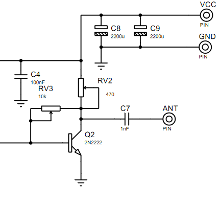
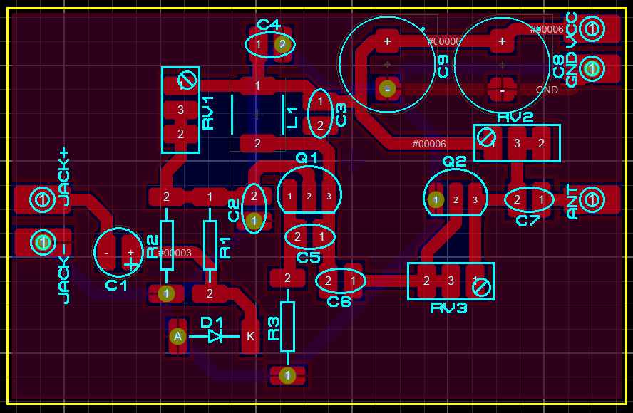
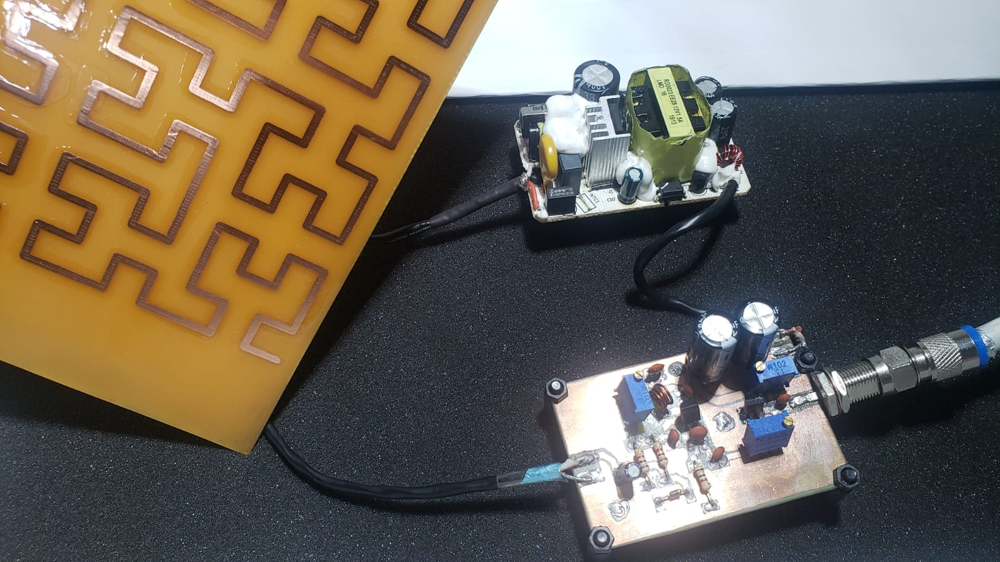

# Circuito PreAmplificador RF

El circuito PreAmplificador consiste en un transistor 2n2222, este circuito tiene la tarea de PreAmplificar la señal del modulador y que este sirva de circuito de acople para la etapa de Amplifiacion de Potencia RF, ya que, se es necesario una salida de baja Impedancia y este circuito lo logra ya que una caracteristica de un amplificador de señal es un alta impedancia de entrada y su baja impedancia de salida...

el diagrama del circuito se muestra acontinuacion...

el PCB en proteus 8.11 es el siguiente...

y los resultado son los siguientes, en la PCB esta conpartiendo baquela con el circuito modulador...

